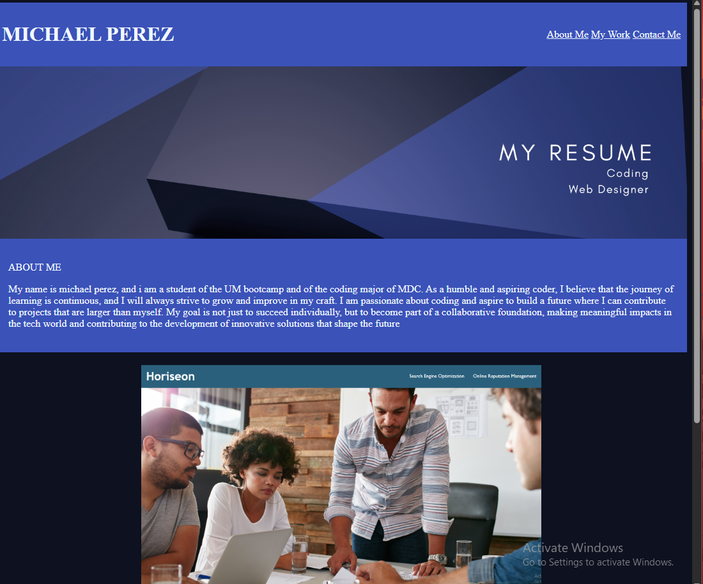

# MyResume

## Table of Contents
- [Description](#description)
- [Installation](#installation)
- [Usage](#usage)
- [Questions](#questions)

## Description
MyResume is an app that simply displays links of github repos along with some of my information like a bio, and contact information.

## Installation
by downloading the github demo and cloning it into your terminal.

## Usage
it is just a display app so you can view the projects i first worked on and a view into my early coding  experience.

## Questions
For any questions, you can reach me at:
- GitHub: [MIKEYP53](https://github.com/MIKEYP53)
- Email: mprz646@gmail.com
